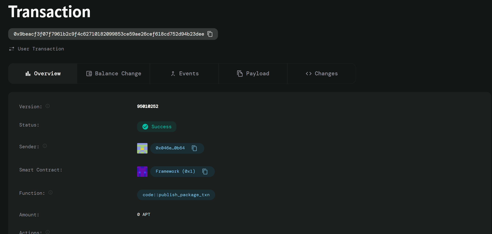

# Aptos Crowdfunding Smart Contract

## Project Description

The Aptos Crowdfunding Smart Contract is a decentralized platform built on the Aptos blockchain that enables entrepreneurs, creators, and innovators to raise funds for their projects in a transparent and secure manner. This smart contract facilitates peer-to-peer funding without intermediaries, allowing project creators to set funding goals and deadlines while providing contributors with full transparency into the funding process.

The contract leverages Aptos' native coin functionality (AptosCoin) to handle secure transactions and implements robust validation mechanisms to ensure the integrity of all crowdfunding operations. Contributors can easily support projects they believe in, while project owners can efficiently manage their campaigns and withdraw funds upon successful completion.

## Project Vision

Our vision is to democratize access to funding by creating a trustless, transparent, and efficient crowdfunding ecosystem on the Aptos blockchain. We aim to:

- **Eliminate Traditional Barriers**: Remove the need for centralized crowdfunding platforms and their associated fees and restrictions
- **Ensure Transparency**: Provide complete visibility into funding progress, contributions, and project status through blockchain technology
- **Enhance Security**: Leverage Aptos' advanced security features to protect both contributors and project creators
- **Foster Innovation**: Enable creators worldwide to bring their ideas to life through decentralized community support
- **Build Trust**: Create a system where smart contracts enforce funding rules automatically, eliminating the need for trust in intermediaries

## Key Features

### 🚀 **Project Creation & Management**
- Create crowdfunding projects with customizable funding goals
- Set flexible project deadlines to create urgency and clear timelines
- Automatic project lifecycle management (active/inactive states)
- Owner-controlled project termination capabilities

### 💰 **Secure Contribution System**
- Safe and transparent contribution mechanism using AptosCoin
- Real-time balance validation to prevent insufficient fund errors
- Automatic contribution tracking for each contributor
- Multiple contribution support from the same contributor

### 🔒 **Advanced Security Features**
- Comprehensive input validation and error handling
- Owner verification for sensitive operations
- Deadline enforcement to prevent late contributions
- Overflow protection for all numerical operations

### 📊 **Transparency & Monitoring**
- Real-time project status queries (funding progress, goal achievement)
- Individual contributor amount tracking
- Public project information access
- Goal achievement verification

### 💸 **Smart Fund Management**
- Automated fund release only when goals are achieved
- Secure withdrawal mechanism for project owners
- Contribution tracking for accountability
- Project completion validation

### 🔍 **View Functions**
- Query project details including funding status and deadlines
- Check goal achievement status
- Retrieve individual contributor amounts
- Verify project existence and activity status

## Future Scope

### Phase 1: Enhanced Features
- **Refund Mechanism**: Implement automatic refunds for failed projects that don't meet their funding goals
- **Milestone-Based Funding**: Allow projects to set multiple funding milestones with partial fund releases
- **Multi-Token Support**: Extend beyond AptosCoin to support other Aptos-native tokens
- **Project Categories**: Implement project categorization for better discovery and organization

### Phase 2: Advanced Functionality
- **Reward Tiers**: Enable project creators to offer different reward levels based on contribution amounts
- **Voting System**: Implement contributor voting for project decisions and milestone approvals
- **Project Updates**: Allow creators to post updates and communicate with their community
- **Reputation System**: Build trust scores for project creators based on their funding history

### Phase 3: Platform Expansion
- **Mobile Integration**: Develop mobile SDKs for easy integration with mobile applications
- **Cross-Chain Compatibility**: Explore bridges to other blockchain networks
- **AI-Powered Discovery**: Implement intelligent project recommendation systems
- **Analytics Dashboard**: Comprehensive analytics for project performance and market insights

### Phase 4: Ecosystem Integration
- **DeFi Integration**: Connect with other DeFi protocols for yield generation on pooled funds
- **NFT Rewards**: Enable creators to offer NFT-based rewards and proof of contribution
- **Governance Token**: Introduce platform governance through a native token
- **Plugin Architecture**: Allow third-party developers to build extensions and integrations

### Long-term Vision
- **Global Adoption**: Become the leading decentralized crowdfunding platform on Aptos
- **Regulatory Compliance**: Implement features to help projects comply with various jurisdictions
- **Social Impact Tracking**: Measure and report the real-world impact of funded projects
- **Sustainability Focus**: Prioritize environmentally and socially beneficial projects

## Contract Details
0x9beacf3f07f7961b2c9f4c62710182099853ce59ae26cef618cd752d94b23dee

